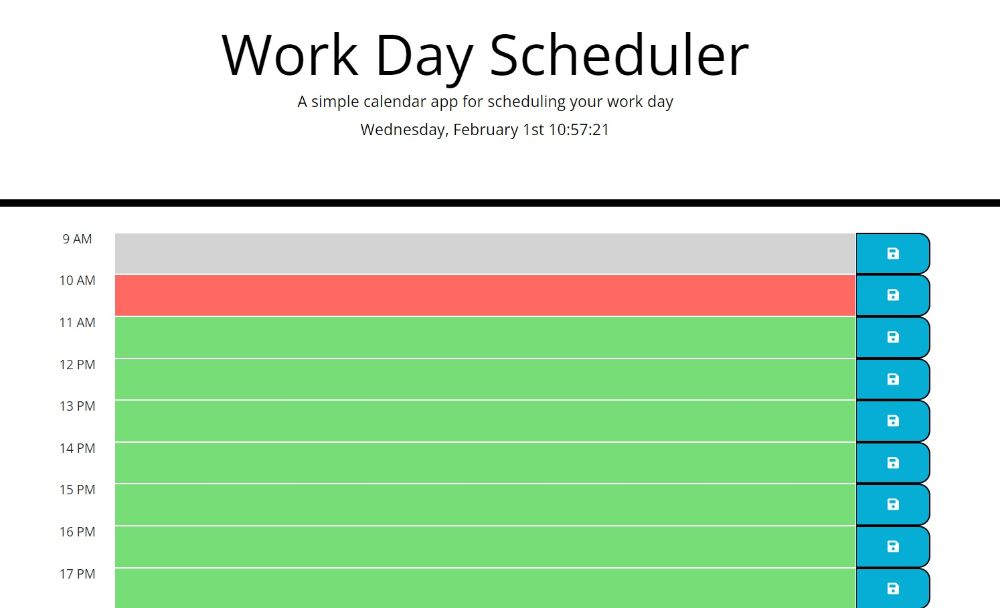

# Work-Day-Scheduler

## User Story

AS AN employee with a busy schedule
I WANT to add important events to a daily planner
SO THAT I can manage my time effectively

## Description
I created this application with jquery using Moment.js to parse, validate, manipulate, and display dates and times in JavaScript

Acceptance critera:

* Display the current day at the top of the calender when a user opens the planner. 
 
* Present timeblocks for standard business hours when the user scrolls down.  
 
* Color-code each timeblock based on past, present, and future when the timeblock is viewed.
 
* Allow a user to enter an event when they click a timeblock.

* Save the event in local storage when the save button is clicked in that timeblock.

* Persist events between refreshes of a page.

## Usage

The app display the current day and time and the textarea for each hour is changing according with the time.

The satore data in localSotarage and retrieve it when refresh the page

Appliction screenshot:

Deployed application: https://github.com/AntonioAlgaba/Work-Day-Scheduler/actions/runs/4063786090/jobs/6996437388

## Credits

https://momentjs.com/

